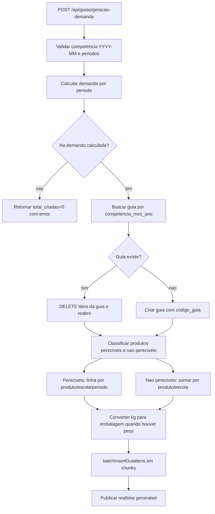

# Fluxo - Guias - Geracao por Demanda

```mermaid
flowchart TD
  A["POST /api/guias/geracao-demanda"] --> B["Validar competencia YYYY-MM e periodos"]
  B --> C["Calcular demanda por periodo"]
  C --> D{"Ha demanda calculada?"}
  D -->|nao| E["Retornar total_criadas=0 com erros"]
  D -->|sim| F["Buscar guia por competencia_mes_ano"]
  F --> G{"Guia existe?"}
  G -->|sim| H["DELETE itens da guia e reabrir"]
  G -->|nao| I["Criar guia com codigo_guia"]
  H --> J["Classificar produtos pereciveis e nao pereciveis"]
  I --> J
  J --> K["Pereciveis: linha por produto/escola/periodo"]
  J --> L["Nao pereciveis: somar por produto/escola"]
  K --> M["Converter kg para embalagem quando houver peso"]
  L --> M
  M --> N["batchInsertGuiaItens em chunks"]
  N --> O["Publicar realtime generated"]
```
