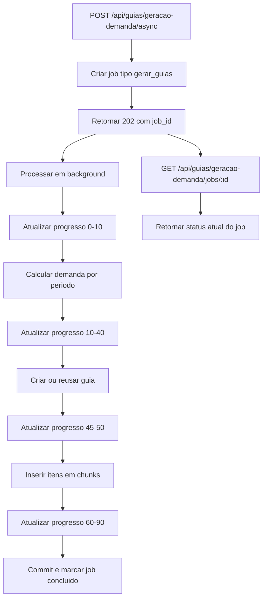

# Fluxo - Guias - Job Assincrono

```mermaid
flowchart TD
  A["POST /api/guias/geracao-demanda/async"] --> B["Criar job tipo gerar_guias"]
  B --> C["Retornar 202 com job_id"]
  C --> D["Processar em background"]
  D --> E["Atualizar progresso 0-10"]
  E --> F["Calcular demanda por periodo"]
  F --> G["Atualizar progresso 10-40"]
  G --> H["Criar ou reusar guia"]
  H --> I["Atualizar progresso 45-50"]
  I --> J["Inserir itens em chunks"]
  J --> K["Atualizar progresso 60-90"]
  K --> L["Commit e marcar job concluido"]
  C --> M["GET /api/guias/geracao-demanda/jobs/:id"]
  M --> N["Retornar status atual do job"]
```
