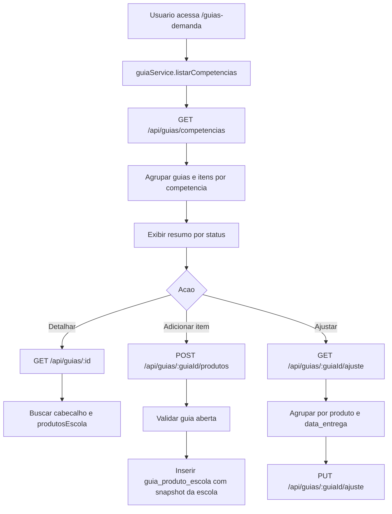

# Fluxo - Modulo Guias

```mermaid
flowchart TD
  A["Usuario acessa /guias-demanda"] --> B["guiaService.listarCompetencias"]
  B --> C["GET /api/guias/competencias"]
  C --> D["Agrupar guias e itens por competencia"]
  D --> E["Exibir resumo por status"]
  E --> F{"Acao"}
  F -->|Detalhar| G["GET /api/guias/:id"]
  G --> H["Buscar cabecalho e produtosEscola"]
  F -->|Adicionar item| I["POST /api/guias/:guiaId/produtos"]
  I --> J["Validar guia aberta"]
  J --> K["Inserir guia_produto_escola com snapshot da escola"]
  F -->|Ajustar| L["GET /api/guias/:guiaId/ajuste"]
  L --> M["Agrupar por produto e data_entrega"]
  M --> N["PUT /api/guias/:guiaId/ajuste"]
```
