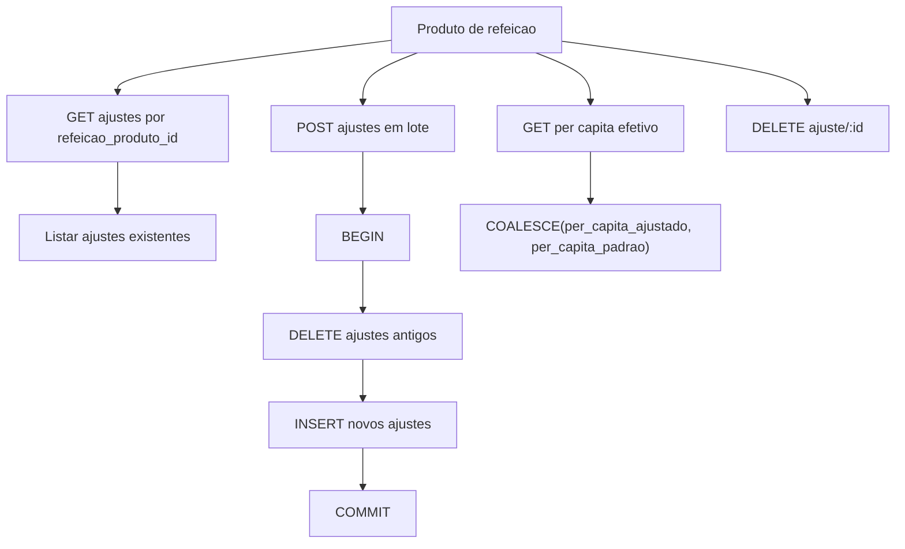

# Fluxo - Nutricao - Ajustes por Modalidade

```mermaid
flowchart TD
  A["Produto de refeicao"] --> B["GET ajustes por refeicao_produto_id"]
  B --> C["Listar ajustes existentes"]
  A --> D["POST ajustes em lote"]
  D --> E["BEGIN"]
  E --> F["DELETE ajustes antigos"]
  F --> G["INSERT novos ajustes"]
  G --> H["COMMIT"]
  A --> I["GET per capita efetivo"]
  I --> J["COALESCE(per_capita_ajustado, per_capita_padrao)"]
  A --> K["DELETE ajuste/:id"]
```
