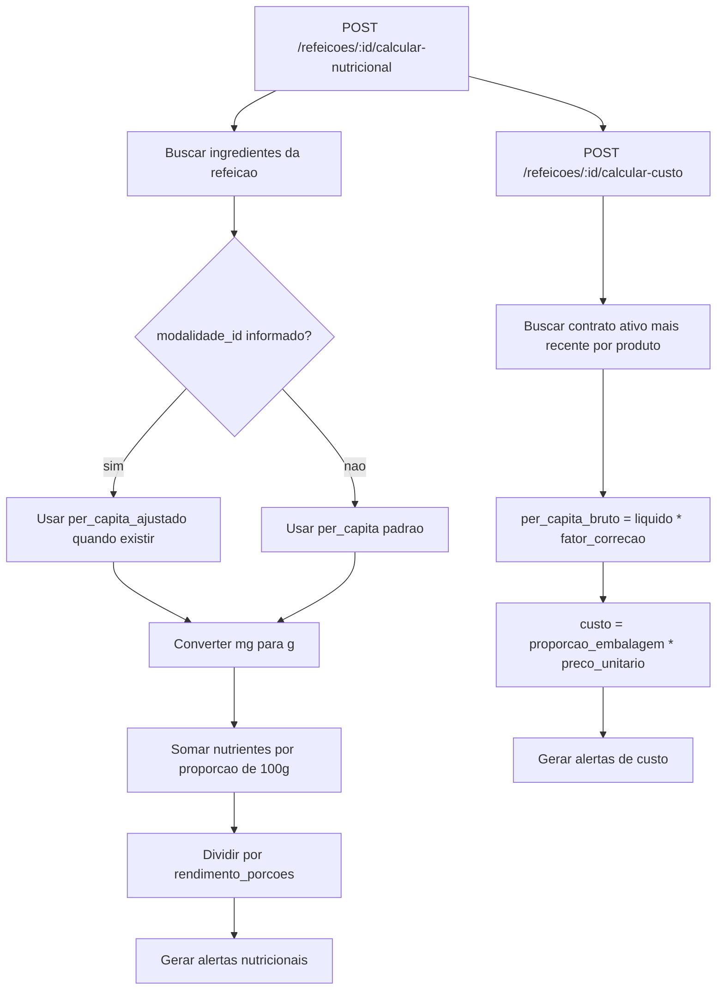

# Fluxo - Nutricao - Calculos de Refeicao

```mermaid
flowchart TD
  A["POST /refeicoes/:id/calcular-nutricional"] --> B["Buscar ingredientes da refeicao"]
  B --> C{"modalidade_id informado?"}
  C -->|sim| D["Usar per_capita_ajustado quando existir"]
  C -->|nao| E["Usar per_capita padrao"]
  D --> F["Converter mg para g"]
  E --> F
  F --> G["Somar nutrientes por proporcao de 100g"]
  G --> H["Dividir por rendimento_porcoes"]
  H --> I["Gerar alertas nutricionais"]
  A --> J["POST /refeicoes/:id/calcular-custo"]
  J --> K["Buscar contrato ativo mais recente por produto"]
  K --> L["per_capita_bruto = liquido * fator_correcao"]
  L --> M["custo = proporcao_embalagem * preco_unitario"]
  M --> N["Gerar alertas de custo"]
```
