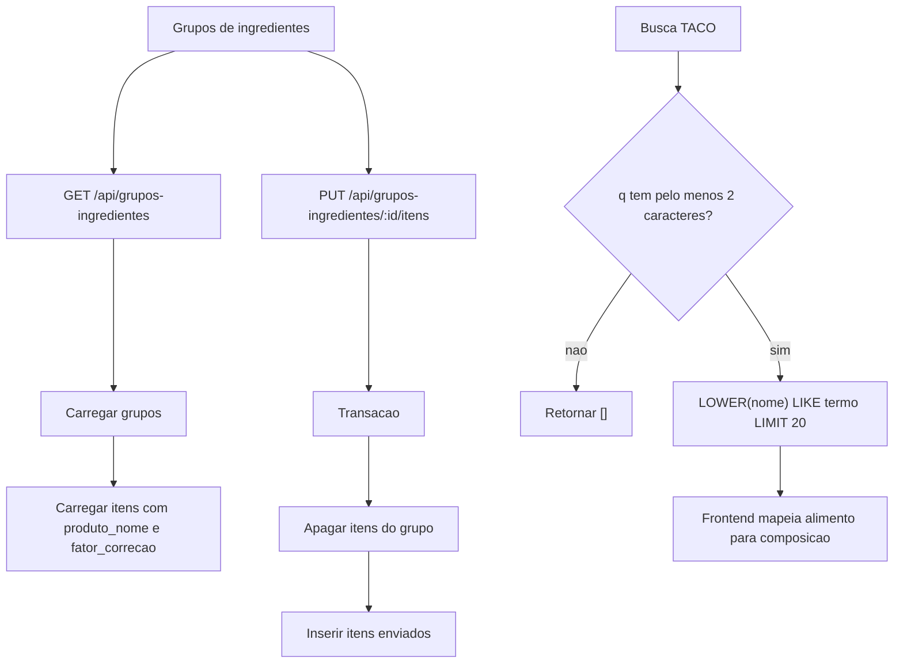

# Fluxo - Nutricao - Grupos e TACO

```mermaid
flowchart TD
  A["Grupos de ingredientes"] --> B["GET /api/grupos-ingredientes"]
  B --> C["Carregar grupos"]
  C --> D["Carregar itens com produto_nome e fator_correcao"]
  A --> E["PUT /api/grupos-ingredientes/:id/itens"]
  E --> F["Transacao"]
  F --> G["Apagar itens do grupo"]
  G --> H["Inserir itens enviados"]
  I["Busca TACO"] --> J{"q tem pelo menos 2 caracteres?"}
  J -->|nao| K["Retornar []"]
  J -->|sim| L["LOWER(nome) LIKE termo LIMIT 20"]
  L --> M["Frontend mapeia alimento para composicao"]
```
