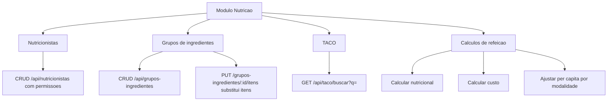

# Fluxo - Modulo Nutricao

```mermaid
flowchart TD
  A["Modulo Nutricao"] --> B["Nutricionistas"]
  A --> C["Grupos de ingredientes"]
  A --> D["TACO"]
  A --> E["Calculos de refeicao"]
  B --> F["CRUD /api/nutricionistas com permissoes"]
  C --> G["CRUD /api/grupos-ingredientes"]
  C --> H["PUT /grupos-ingredientes/:id/itens substitui itens"]
  D --> I["GET /api/taco/buscar?q="]
  E --> J["Calcular nutricional"]
  E --> K["Calcular custo"]
  E --> L["Ajustar per capita por modalidade"]
```
