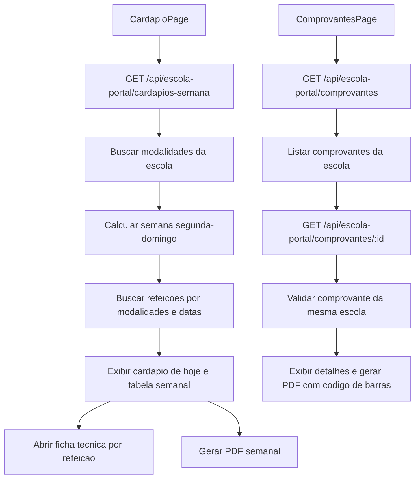

# Fluxo - Portal Escola - Cardapio e Comprovantes

```mermaid
flowchart TD
  A["CardapioPage"] --> B["GET /api/escola-portal/cardapios-semana"]
  B --> C["Buscar modalidades da escola"]
  C --> D["Calcular semana segunda-domingo"]
  D --> E["Buscar refeicoes por modalidades e datas"]
  E --> F["Exibir cardapio de hoje e tabela semanal"]
  F --> G["Abrir ficha tecnica por refeicao"]
  F --> H["Gerar PDF semanal"]
  I["ComprovantesPage"] --> J["GET /api/escola-portal/comprovantes"]
  J --> K["Listar comprovantes da escola"]
  K --> L["GET /api/escola-portal/comprovantes/:id"]
  L --> M["Validar comprovante da mesma escola"]
  M --> N["Exibir detalhes e gerar PDF com codigo de barras"]
```
