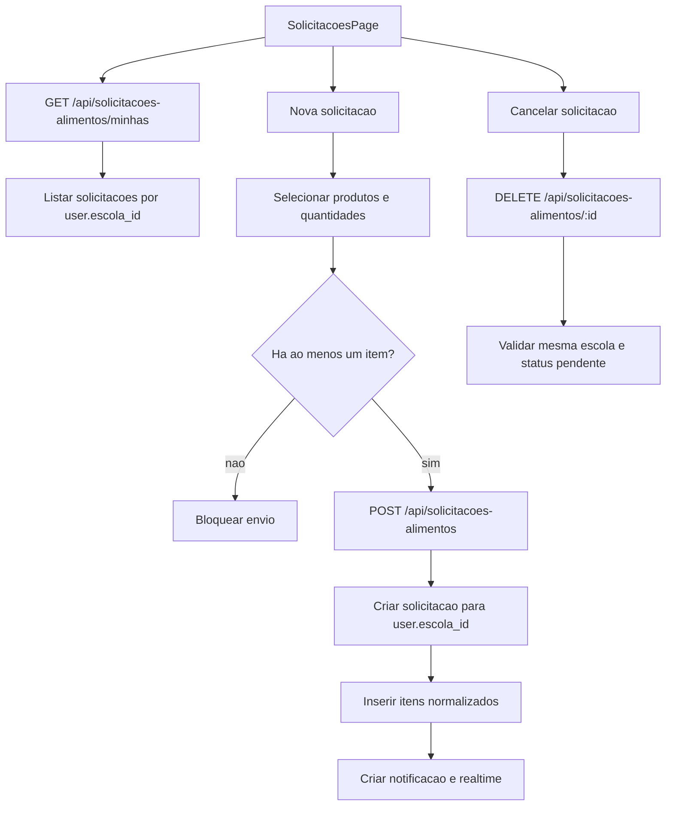

# Fluxo - Portal Escola - Solicitacoes

```mermaid
flowchart TD
  A["SolicitacoesPage"] --> B["GET /api/solicitacoes-alimentos/minhas"]
  B --> C["Listar solicitacoes por user.escola_id"]
  A --> D["Nova solicitacao"]
  D --> E["Selecionar produtos e quantidades"]
  E --> F{"Ha ao menos um item?"}
  F -->|nao| G["Bloquear envio"]
  F -->|sim| H["POST /api/solicitacoes-alimentos"]
  H --> I["Criar solicitacao para user.escola_id"]
  I --> J["Inserir itens normalizados"]
  J --> K["Criar notificacao e realtime"]
  A --> L["Cancelar solicitacao"]
  L --> M["DELETE /api/solicitacoes-alimentos/:id"]
  M --> N["Validar mesma escola e status pendente"]
```
