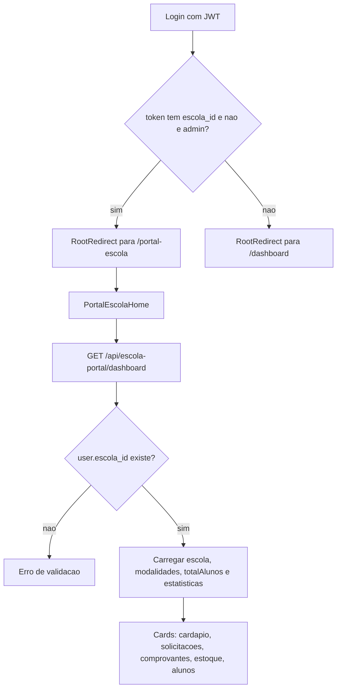

# Fluxo - Modulo Portal Escola

```mermaid
flowchart TD
  A["Login com JWT"] --> B{"token tem escola_id e nao e admin?"}
  B -->|sim| C["RootRedirect para /portal-escola"]
  B -->|nao| D["RootRedirect para /dashboard"]
  C --> E["PortalEscolaHome"]
  E --> F["GET /api/escola-portal/dashboard"]
  F --> G{"user.escola_id existe?"}
  G -->|nao| H["Erro de validacao"]
  G -->|sim| I["Carregar escola, modalidades, totalAlunos e estatisticas"]
  I --> J["Cards: cardapio, solicitacoes, comprovantes, estoque, alunos"]
```
