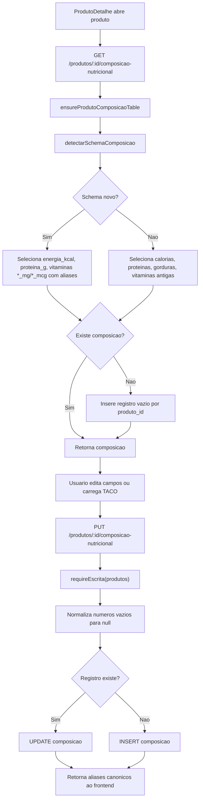

```mermaid
flowchart TD
  A["ProdutoDetalhe abre produto"] --> B["GET /produtos/:id/composicao-nutricional"]
  B --> C["ensureProdutoComposicaoTable"]
  C --> D["detectarSchemaComposicao"]
  D --> E{"Schema novo?"}
  E -->|Sim| F["Seleciona energia_kcal, proteina_g, vitaminas *_mg/*_mcg com aliases"]
  E -->|Nao| G["Seleciona calorias, proteinas, gorduras, vitaminas antigas"]
  F --> H{"Existe composicao?"}
  G --> H
  H -->|Nao| I["Insere registro vazio por produto_id"]
  H -->|Sim| J["Retorna composicao"]
  I --> J
  J --> K["Usuario edita campos ou carrega TACO"]
  K --> L["PUT /produtos/:id/composicao-nutricional"]
  L --> M["requireEscrita(produtos)"]
  M --> N["Normaliza numeros vazios para null"]
  N --> O{"Registro existe?"}
  O -->|Sim| P["UPDATE composicao"]
  O -->|Nao| Q["INSERT composicao"]
  P --> R["Retorna aliases canonicos ao frontend"]
  Q --> R
```
