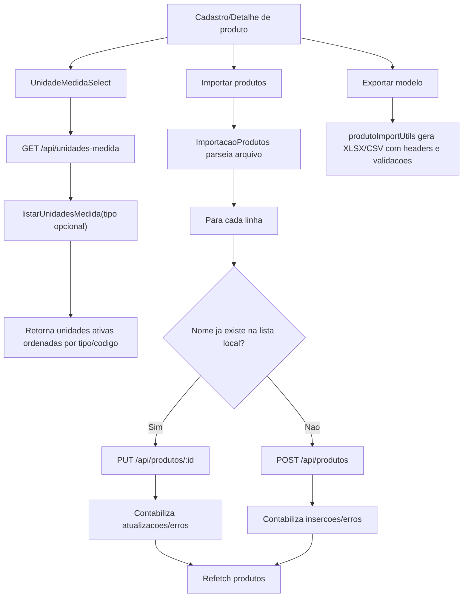

```mermaid
flowchart TD
  A["Cadastro/Detalhe de produto"] --> B["UnidadeMedidaSelect"]
  B --> C["GET /api/unidades-medida"]
  C --> D["listarUnidadesMedida(tipo opcional)"]
  D --> E["Retorna unidades ativas ordenadas por tipo/codigo"]
  A --> F["Importar produtos"]
  F --> G["ImportacaoProdutos parseia arquivo"]
  G --> H["Para cada linha"]
  H --> I{"Nome ja existe na lista local?"}
  I -->|Sim| J["PUT /api/produtos/:id"]
  I -->|Nao| K["POST /api/produtos"]
  J --> L["Contabiliza atualizacoes/erros"]
  K --> M["Contabiliza insercoes/erros"]
  L --> N["Refetch produtos"]
  M --> N
  A --> O["Exportar modelo"]
  O --> P["produtoImportUtils gera XLSX/CSV com headers e validacoes"]
```
