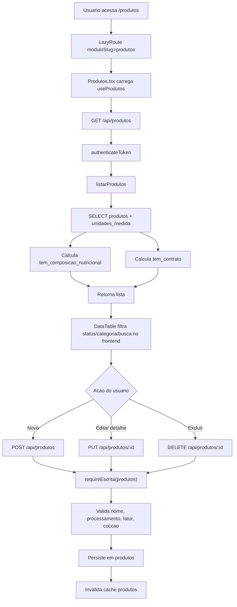

```mermaid
flowchart TD
  A["Usuario acessa /produtos"] --> B["LazyRoute moduloSlug=produtos"]
  B --> C["Produtos.tsx carrega useProdutos"]
  C --> D["GET /api/produtos"]
  D --> E["authenticateToken"]
  E --> F["listarProdutos"]
  F --> G["SELECT produtos + unidades_medida"]
  G --> H["Calcula tem_composicao_nutricional"]
  G --> I["Calcula tem_contrato"]
  H --> J["Retorna lista"]
  I --> J
  J --> K["DataTable filtra status/categoria/busca no frontend"]
  K --> L{"Acao do usuario"}
  L -->|Novo| M["POST /api/produtos"]
  L -->|Editar detalhe| N["PUT /api/produtos/:id"]
  L -->|Excluir| O["DELETE /api/produtos/:id"]
  M --> P["requireEscrita(produtos)"]
  N --> P
  O --> P
  P --> Q["Valida nome, processamento, fator, coccao"]
  Q --> R["Persiste em produtos"]
  R --> S["Invalida cache produtos"]
```
