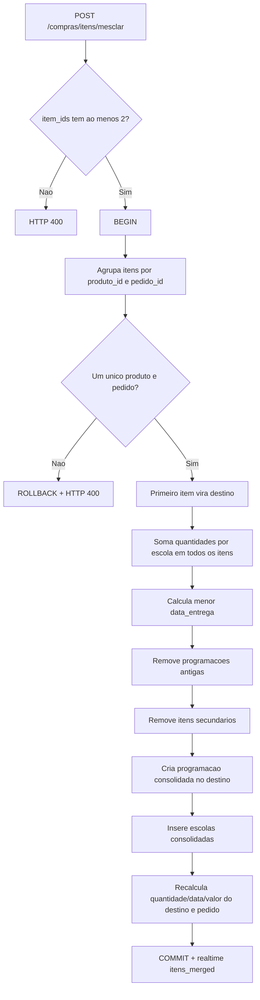

```mermaid
flowchart TD
  A["POST /compras/itens/mesclar"] --> B{"item_ids tem ao menos 2?"}
  B -- "Nao" --> C["HTTP 400"]
  B -- "Sim" --> D["BEGIN"]
  D --> E["Agrupa itens por produto_id e pedido_id"]
  E --> F{"Um unico produto e pedido?"}
  F -- "Nao" --> G["ROLLBACK + HTTP 400"]
  F -- "Sim" --> H["Primeiro item vira destino"]
  H --> I["Soma quantidades por escola em todos os itens"]
  I --> J["Calcula menor data_entrega"]
  J --> K["Remove programacoes antigas"]
  K --> L["Remove itens secundarios"]
  L --> M["Cria programacao consolidada no destino"]
  M --> N["Insere escolas consolidadas"]
  N --> O["Recalcula quantidade/data/valor do destino e pedido"]
  O --> P["COMMIT + realtime itens_merged"]
```
