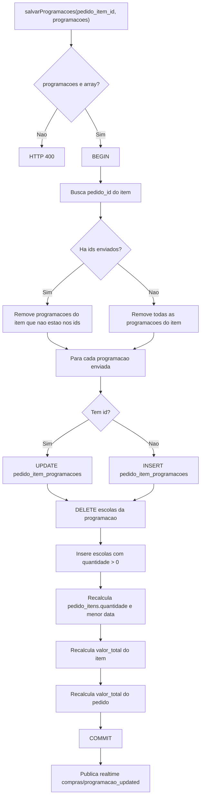

```mermaid
flowchart TD
  A["salvarProgramacoes(pedido_item_id, programacoes)"] --> B{"programacoes e array?"}
  B -- "Nao" --> C["HTTP 400"]
  B -- "Sim" --> D["BEGIN"]
  D --> E["Busca pedido_id do item"]
  E --> F{"Ha ids enviados?"}
  F -- "Sim" --> G["Remove programacoes do item que nao estao nos ids"]
  F -- "Nao" --> H["Remove todas as programacoes do item"]
  G --> I["Para cada programacao enviada"]
  H --> I
  I --> J{"Tem id?"}
  J -- "Sim" --> K["UPDATE pedido_item_programacoes"]
  J -- "Nao" --> L["INSERT pedido_item_programacoes"]
  K --> M["DELETE escolas da programacao"]
  L --> M
  M --> N["Insere escolas com quantidade > 0"]
  N --> O["Recalcula pedido_itens.quantidade e menor data"]
  O --> P["Recalcula valor_total do item"]
  P --> Q["Recalcula valor_total do pedido"]
  Q --> R["COMMIT"]
  R --> S["Publica realtime compras/programacao_updated"]
```
