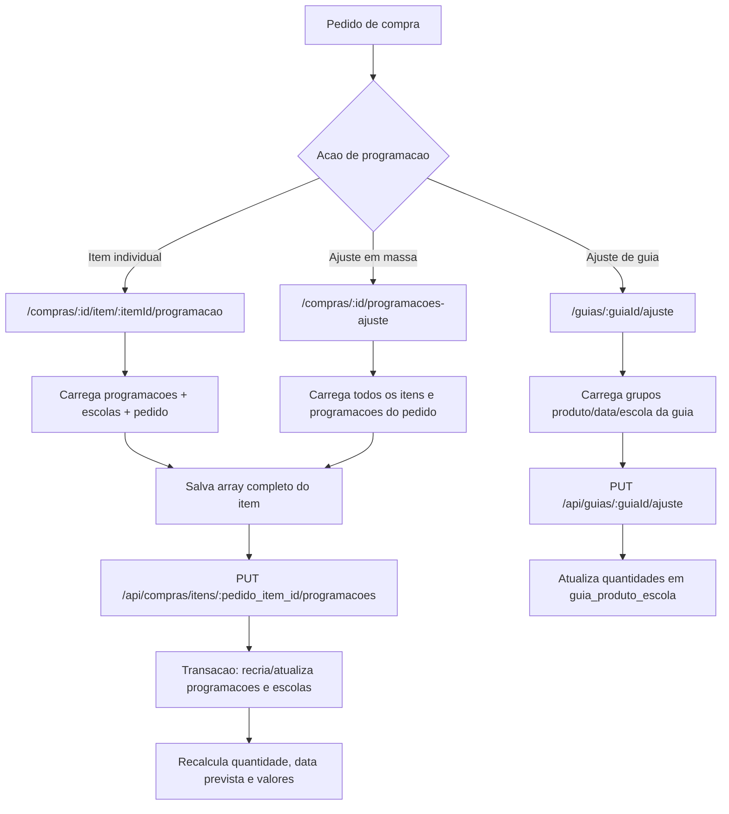

```mermaid
flowchart TD
  A["Pedido de compra"] --> B{"Acao de programacao"}
  B -->|Item individual| C["/compras/:id/item/:itemId/programacao"]
  B -->|Ajuste em massa| D["/compras/:id/programacoes-ajuste"]
  B -->|Ajuste de guia| E["/guias/:guiaId/ajuste"]
  C --> F["Carrega programacoes + escolas + pedido"]
  D --> G["Carrega todos os itens e programacoes do pedido"]
  E --> H["Carrega grupos produto/data/escola da guia"]
  F --> I["Salva array completo do item"]
  G --> I
  I --> J["PUT /api/compras/itens/:pedido_item_id/programacoes"]
  J --> K["Transacao: recria/atualiza programacoes e escolas"]
  K --> L["Recalcula quantidade, data prevista e valores"]
  H --> M["PUT /api/guias/:guiaId/ajuste"]
  M --> N["Atualiza quantidades em guia_produto_escola"]
```
