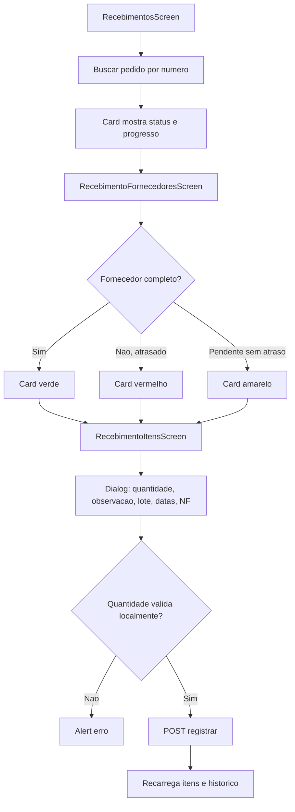

```mermaid
flowchart TD
  A["RecebimentosScreen"] --> B["Buscar pedido por numero"]
  B --> C["Card mostra status e progresso"]
  C --> D["RecebimentoFornecedoresScreen"]
  D --> E{"Fornecedor completo?"}
  E -- "Sim" --> F["Card verde"]
  E -- "Nao, atrasado" --> G["Card vermelho"]
  E -- "Pendente sem atraso" --> H["Card amarelo"]
  F --> I["RecebimentoItensScreen"]
  G --> I
  H --> I
  I --> J["Dialog: quantidade, observacao, lote, datas, NF"]
  J --> K{"Quantidade valida localmente?"}
  K -- "Nao" --> L["Alert erro"]
  K -- "Sim" --> M["POST registrar"]
  M --> N["Recarrega itens e historico"]
```
