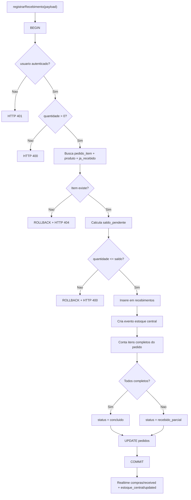

```mermaid
flowchart TD
  A["registrarRecebimento(payload)"] --> B["BEGIN"]
  B --> C{"usuario autenticado?"}
  C -- "Nao" --> D["HTTP 401"]
  C -- "Sim" --> E{"quantidade > 0?"}
  E -- "Nao" --> F["HTTP 400"]
  E -- "Sim" --> G["Busca pedido_item + produto + ja_recebido"]
  G --> H{"Item existe?"}
  H -- "Nao" --> I["ROLLBACK + HTTP 404"]
  H -- "Sim" --> J["Calcula saldo_pendente"]
  J --> K{"quantidade <= saldo?"}
  K -- "Nao" --> L["ROLLBACK + HTTP 400"]
  K -- "Sim" --> M["Insere em recebimentos"]
  M --> N["Cria evento estoque central"]
  N --> O["Conta itens completos do pedido"]
  O --> P{"Todos completos?"}
  P -- "Sim" --> Q["status = concluido"]
  P -- "Nao" --> R["status = recebido_parcial"]
  Q --> S["UPDATE pedidos"]
  R --> S
  S --> T["COMMIT"]
  T --> U["Realtime compras/received + estoque_central/updated"]
```
