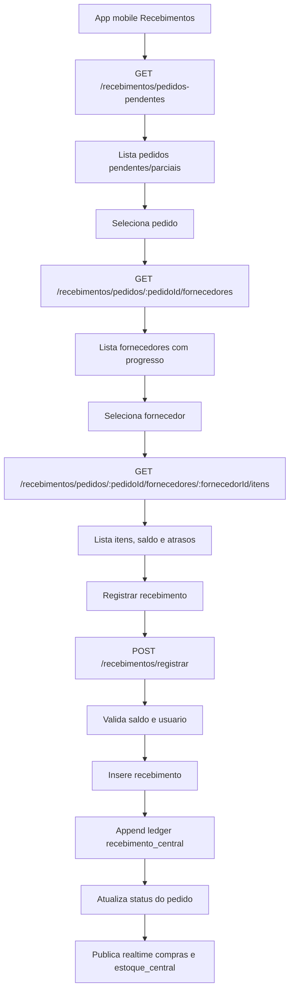

```mermaid
flowchart TD
  A["App mobile Recebimentos"] --> B["GET /recebimentos/pedidos-pendentes"]
  B --> C["Lista pedidos pendentes/parciais"]
  C --> D["Seleciona pedido"]
  D --> E["GET /recebimentos/pedidos/:pedidoId/fornecedores"]
  E --> F["Lista fornecedores com progresso"]
  F --> G["Seleciona fornecedor"]
  G --> H["GET /recebimentos/pedidos/:pedidoId/fornecedores/:fornecedorId/itens"]
  H --> I["Lista itens, saldo e atrasos"]
  I --> J["Registrar recebimento"]
  J --> K["POST /recebimentos/registrar"]
  K --> L["Valida saldo e usuario"]
  L --> M["Insere recebimento"]
  M --> N["Append ledger recebimento_central"]
  N --> O["Atualiza status do pedido"]
  O --> P["Publica realtime compras e estoque_central"]
```
