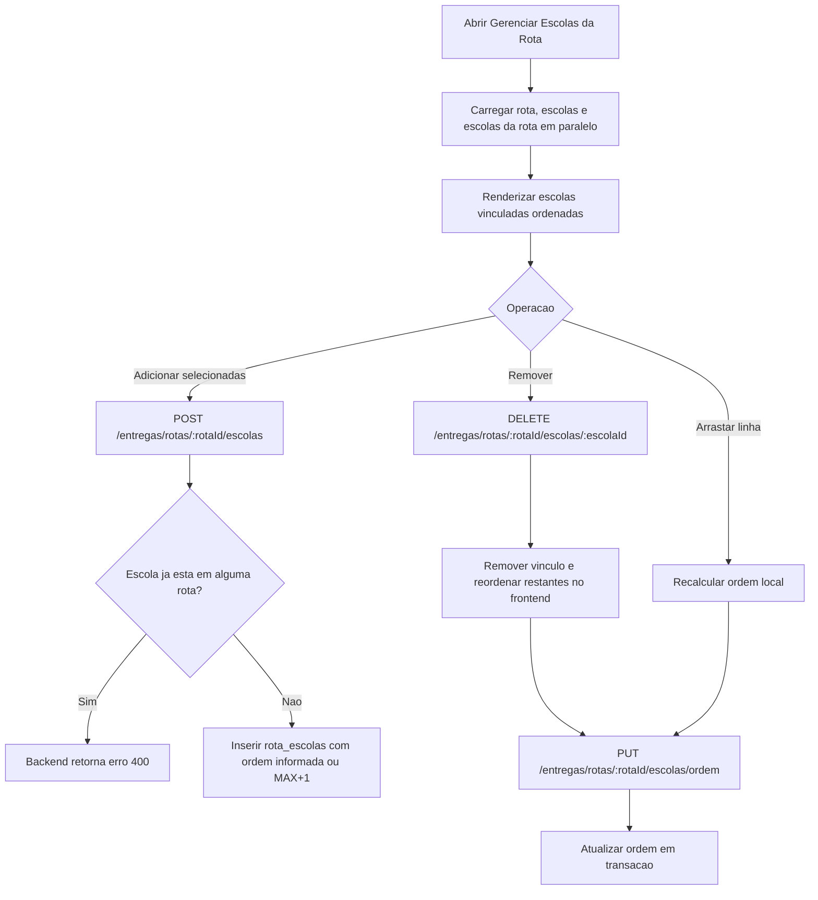

# Fluxo - Rotas e escolas

```mermaid
flowchart TD
  A["Abrir Gerenciar Escolas da Rota"] --> B["Carregar rota, escolas e escolas da rota em paralelo"]
  B --> C["Renderizar escolas vinculadas ordenadas"]
  C --> D{"Operacao"}
  D -->|Adicionar selecionadas| E["POST /entregas/rotas/:rotaId/escolas"]
  E --> F{"Escola ja esta em alguma rota?"}
  F -->|Sim| G["Backend retorna erro 400"]
  F -->|Nao| H["Inserir rota_escolas com ordem informada ou MAX+1"]
  D -->|Remover| I["DELETE /entregas/rotas/:rotaId/escolas/:escolaId"]
  I --> J["Remover vinculo e reordenar restantes no frontend"]
  J --> K["PUT /entregas/rotas/:rotaId/escolas/ordem"]
  D -->|Arrastar linha| L["Recalcular ordem local"]
  L --> K
  K --> M["Atualizar ordem em transacao"]
```
