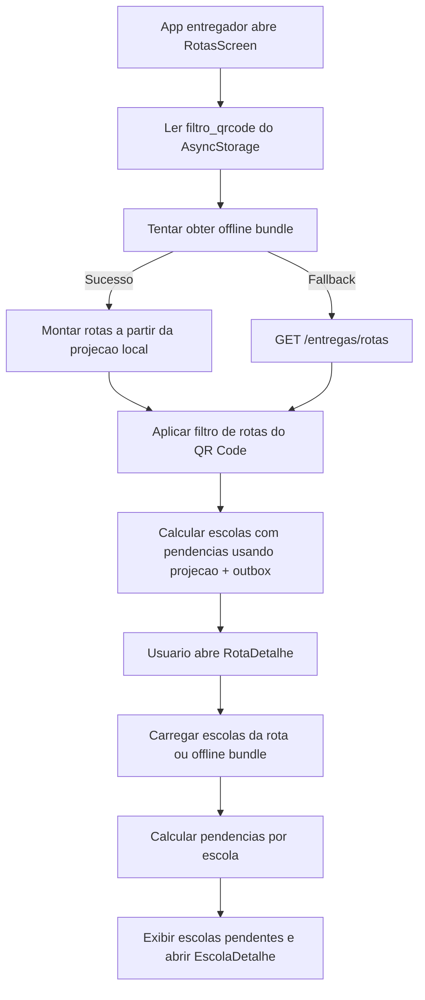

# Fluxo - Rotas no app entregador

```mermaid
flowchart TD
  A["App entregador abre RotasScreen"] --> B["Ler filtro_qrcode do AsyncStorage"]
  B --> C["Tentar obter offline bundle"]
  C -->|Sucesso| D["Montar rotas a partir da projecao local"]
  C -->|Fallback| E["GET /entregas/rotas"]
  D --> F["Aplicar filtro de rotas do QR Code"]
  E --> F
  F --> G["Calcular escolas com pendencias usando projecao + outbox"]
  G --> H["Usuario abre RotaDetalhe"]
  H --> I["Carregar escolas da rota ou offline bundle"]
  I --> J["Calcular pendencias por escola"]
  J --> K["Exibir escolas pendentes e abrir EscolaDetalhe"]
```
