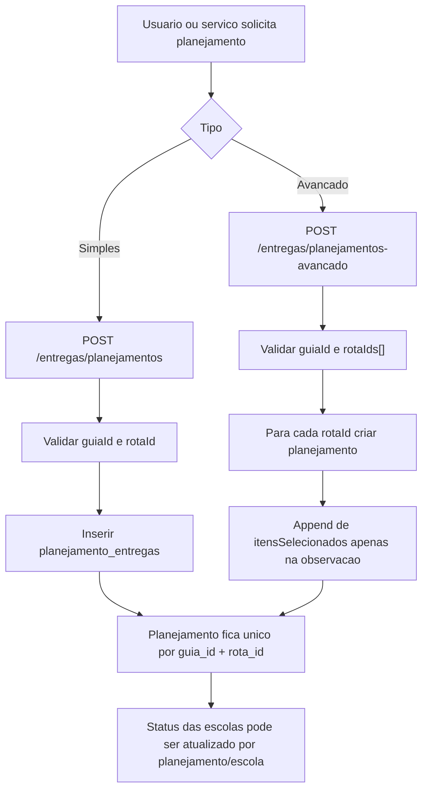

# Fluxo - Planejamento de rotas

```mermaid
flowchart TD
  A["Usuario ou servico solicita planejamento"] --> B{"Tipo"}
  B -->|Simples| C["POST /entregas/planejamentos"]
  C --> D["Validar guiaId e rotaId"]
  D --> E["Inserir planejamento_entregas"]
  B -->|Avancado| F["POST /entregas/planejamentos-avancado"]
  F --> G["Validar guiaId e rotaIds[]"]
  G --> H["Para cada rotaId criar planejamento"]
  H --> I["Append de itensSelecionados apenas na observacao"]
  E --> J["Planejamento fica unico por guia_id + rota_id"]
  I --> J
  J --> K["Status das escolas pode ser atualizado por planejamento/escola"]
```
