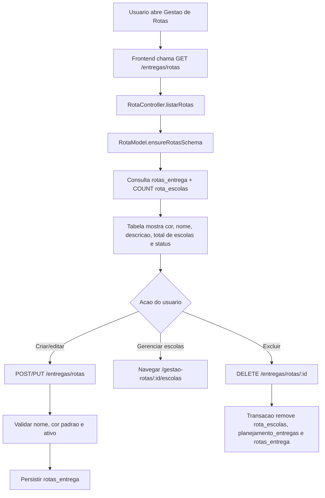

# Fluxo - Modulo rotas

```mermaid
flowchart TD
  A["Usuario abre Gestao de Rotas"] --> B["Frontend chama GET /entregas/rotas"]
  B --> C["RotaController.listarRotas"]
  C --> D["RotaModel.ensureRotasSchema"]
  D --> E["Consulta rotas_entrega + COUNT rota_escolas"]
  E --> F["Tabela mostra cor, nome, descricao, total de escolas e status"]
  F --> G{"Acao do usuario"}
  G -->|Criar/editar| H["POST/PUT /entregas/rotas"]
  H --> I["Validar nome, cor padrao e ativo"]
  I --> J["Persistir rotas_entrega"]
  G -->|Gerenciar escolas| K["Navegar /gestao-rotas/:id/escolas"]
  G -->|Excluir| L["DELETE /entregas/rotas/:id"]
  L --> M["Transacao remove rota_escolas, planejamento_entregas e rotas_entrega"]
```
