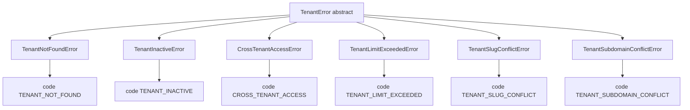

# Fluxo: Shared - erros de tenant

```mermaid
flowchart TD
  A["TenantError abstract"] --> B["TenantNotFoundError"]
  A --> C["TenantInactiveError"]
  A --> D["CrossTenantAccessError"]
  A --> E["TenantLimitExceededError"]
  A --> F["TenantSlugConflictError"]
  A --> G["TenantSubdomainConflictError"]
  B --> H["code TENANT_NOT_FOUND"]
  C --> I["code TENANT_INACTIVE"]
  D --> J["code CROSS_TENANT_ACCESS"]
  E --> K["code TENANT_LIMIT_EXCEEDED"]
  F --> L["code TENANT_SLUG_CONFLICT"]
  G --> M["code TENANT_SUBDOMAIN_CONFLICT"]
```

## Evidencias

- `shared/types/index.ts`
