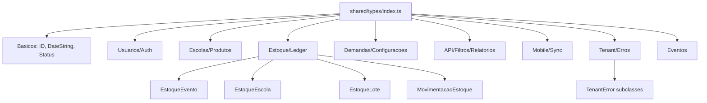

# Fluxo: Shared - mapa de tipos

```mermaid
flowchart TD
  A["shared/types/index.ts"] --> B["Basicos: ID, DateString, Status"]
  A --> C["Usuarios/Auth"]
  A --> D["Escolas/Produtos"]
  A --> E["Estoque/Ledger"]
  A --> F["Demandas/Configuracoes"]
  A --> G["API/Filtros/Relatorios"]
  A --> H["Mobile/Sync"]
  A --> I["Tenant/Erros"]
  A --> J["Eventos"]
  E --> K["EstoqueEvento"]
  E --> L["EstoqueEscola"]
  E --> M["EstoqueLote"]
  E --> N["MovimentacaoEstoque"]
  I --> O["TenantError subclasses"]
```

## Evidencias

- `shared/types/index.ts`
- `shared/package.json`
- `shared/tsconfig.json`
