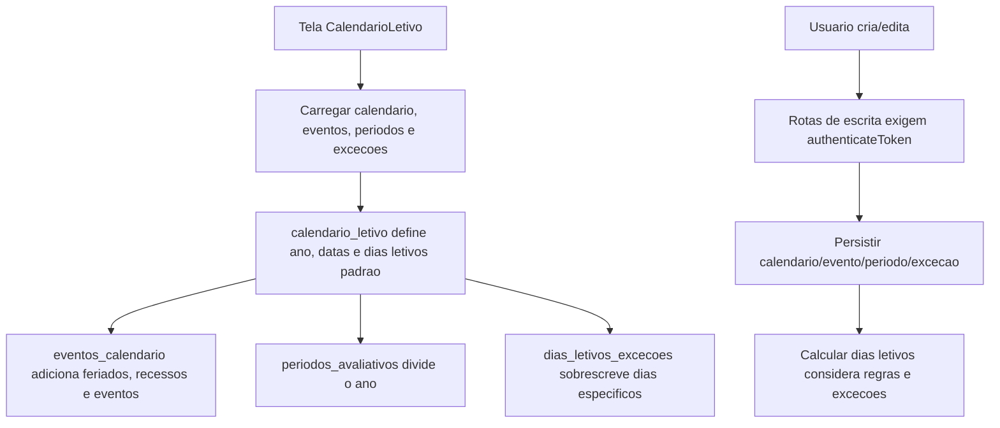

# Fluxo - Calendario letivo

```mermaid
flowchart TD
  A["Tela CalendarioLetivo"] --> B["Carregar calendario, eventos, periodos e excecoes"]
  B --> C["calendario_letivo define ano, datas e dias letivos padrao"]
  C --> D["eventos_calendario adiciona feriados, recessos e eventos"]
  C --> E["periodos_avaliativos divide o ano"]
  C --> F["dias_letivos_excecoes sobrescreve dias especificos"]
  G["Usuario cria/edita"] --> H["Rotas de escrita exigem authenticateToken"]
  H --> I["Persistir calendario/evento/periodo/excecao"]
  I --> J["Calcular dias letivos considera regras e excecoes"]
```
