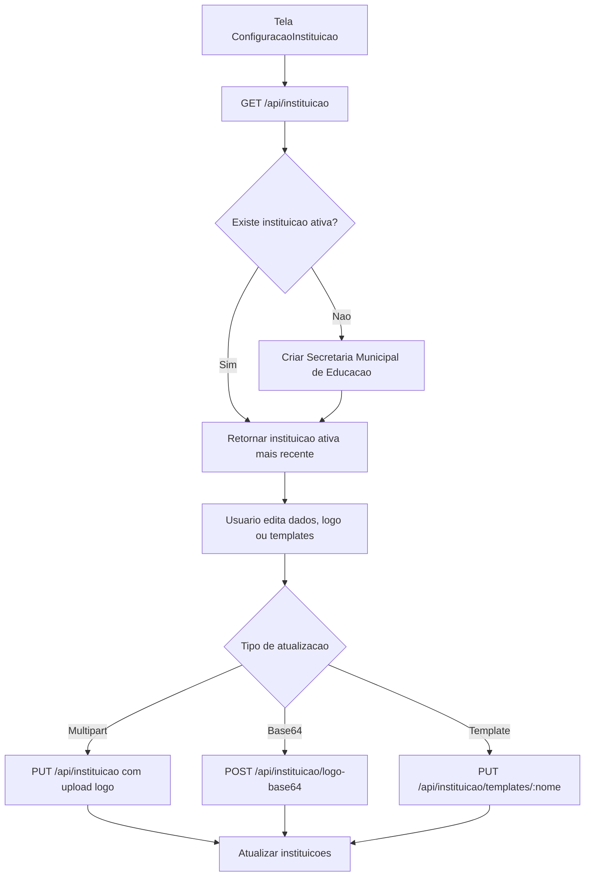

# Fluxo - Instituicao e templates

```mermaid
flowchart TD
  A["Tela ConfiguracaoInstituicao"] --> B["GET /api/instituicao"]
  B --> C{"Existe instituicao ativa?"}
  C -->|Nao| D["Criar Secretaria Municipal de Educacao"]
  C -->|Sim| E["Retornar instituicao ativa mais recente"]
  D --> E
  E --> F["Usuario edita dados, logo ou templates"]
  F --> G{"Tipo de atualizacao"}
  G -->|Multipart| H["PUT /api/instituicao com upload logo"]
  G -->|Base64| I["POST /api/instituicao/logo-base64"]
  G -->|Template| J["PUT /api/instituicao/templates/:nome"]
  H --> K["Atualizar instituicoes"]
  I --> K
  J --> K
```
