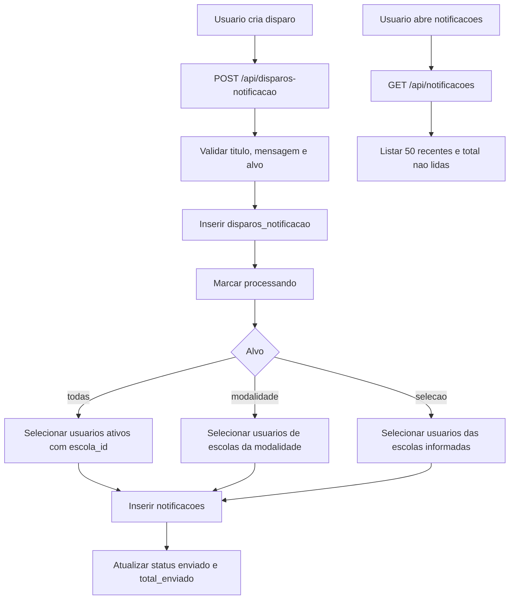

# Fluxo - Notificacoes e disparos

```mermaid
flowchart TD
  A["Usuario cria disparo"] --> B["POST /api/disparos-notificacao"]
  B --> C["Validar titulo, mensagem e alvo"]
  C --> D["Inserir disparos_notificacao"]
  D --> E["Marcar processando"]
  E --> F{"Alvo"}
  F -->|todas| G["Selecionar usuarios ativos com escola_id"]
  F -->|modalidade| H["Selecionar usuarios de escolas da modalidade"]
  F -->|selecao| I["Selecionar usuarios das escolas informadas"]
  G --> J["Inserir notificacoes"]
  H --> J
  I --> J
  J --> K["Atualizar status enviado e total_enviado"]
  L["Usuario abre notificacoes"] --> M["GET /api/notificacoes"]
  M --> N["Listar 50 recentes e total nao lidas"]
```
