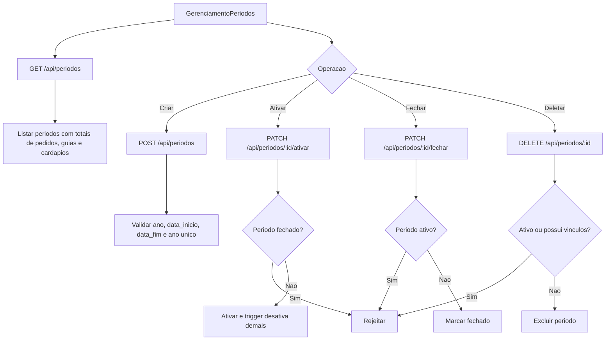

# Fluxo - Periodos do sistema

```mermaid
flowchart TD
  A["GerenciamentoPeriodos"] --> B["GET /api/periodos"]
  B --> C["Listar periodos com totais de pedidos, guias e cardapios"]
  A --> D{"Operacao"}
  D -->|Criar| E["POST /api/periodos"]
  E --> F["Validar ano, data_inicio, data_fim e ano unico"]
  D -->|Ativar| G["PATCH /api/periodos/:id/ativar"]
  G --> H{"Periodo fechado?"}
  H -->|Sim| I["Rejeitar"]
  H -->|Nao| J["Ativar e trigger desativa demais"]
  D -->|Fechar| K["PATCH /api/periodos/:id/fechar"]
  K --> L{"Periodo ativo?"}
  L -->|Sim| I
  L -->|Nao| M["Marcar fechado"]
  D -->|Deletar| N["DELETE /api/periodos/:id"]
  N --> O{"Ativo ou possui vinculos?"}
  O -->|Sim| I
  O -->|Nao| P["Excluir periodo"]
```
