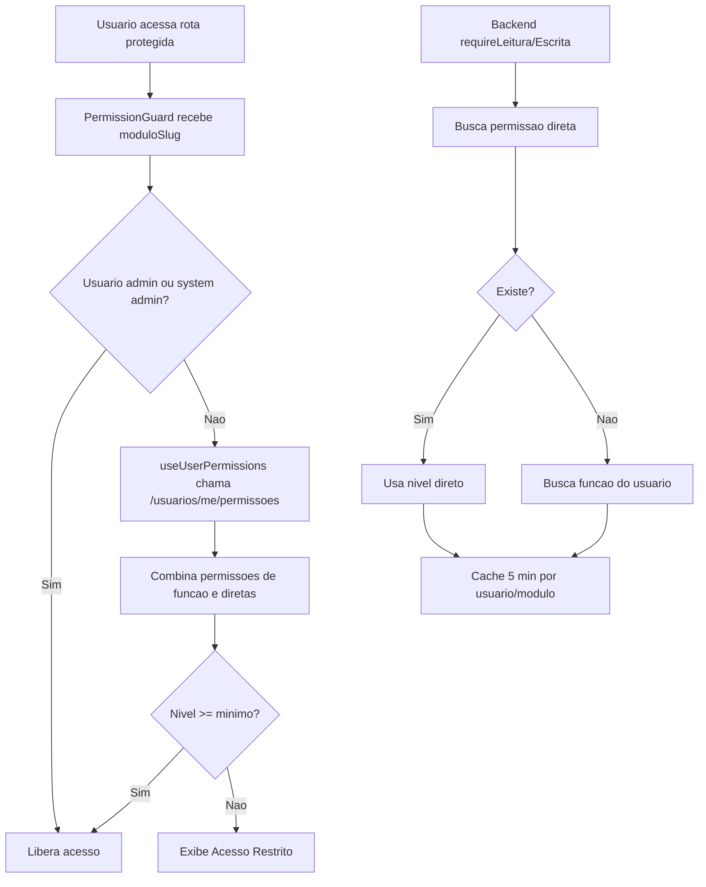

# Fluxo - Permissoes do sistema

```mermaid
flowchart TD
  A["Usuario acessa rota protegida"] --> B["PermissionGuard recebe moduloSlug"]
  B --> C{"Usuario admin ou system admin?"}
  C -->|Sim| D["Libera acesso"]
  C -->|Nao| E["useUserPermissions chama /usuarios/me/permissoes"]
  E --> F["Combina permissoes de funcao e diretas"]
  F --> G{"Nivel >= minimo?"}
  G -->|Sim| D
  G -->|Nao| H["Exibe Acesso Restrito"]
  I["Backend requireLeitura/Escrita"] --> J["Busca permissao direta"]
  J --> K{"Existe?"}
  K -->|Sim| L["Usa nivel direto"]
  K -->|Nao| M["Busca funcao do usuario"]
  L --> N["Cache 5 min por usuario/modulo"]
  M --> N
```
