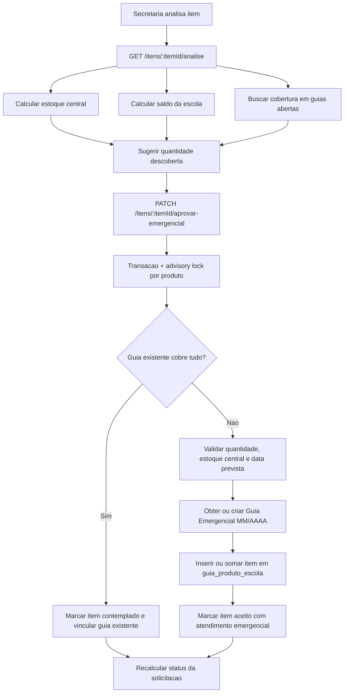

# Fluxo - Atendimento emergencial

```mermaid
flowchart TD
  A["Secretaria analisa item"] --> B["GET /itens/:itemId/analise"]
  B --> C["Calcular estoque central"]
  B --> D["Calcular saldo da escola"]
  B --> E["Buscar cobertura em guias abertas"]
  C --> F["Sugerir quantidade descoberta"]
  D --> F
  E --> F
  F --> G["PATCH /itens/:itemId/aprovar-emergencial"]
  G --> H["Transacao + advisory lock por produto"]
  H --> I{"Guia existente cobre tudo?"}
  I -->|Sim| J["Marcar item contemplado e vincular guia existente"]
  I -->|Nao| K["Validar quantidade, estoque central e data prevista"]
  K --> L["Obter ou criar Guia Emergencial MM/AAAA"]
  L --> M["Inserir ou somar item em guia_produto_escola"]
  M --> N["Marcar item aceito com atendimento emergencial"]
  J --> O["Recalcular status da solicitacao"]
  N --> O
```
