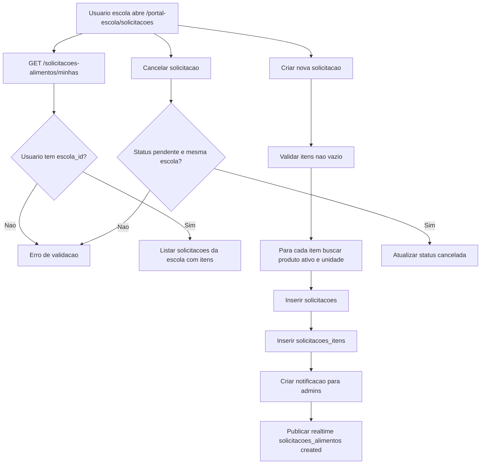

# Fluxo - Solicitacao pelo portal escola

```mermaid
flowchart TD
  A["Usuario escola abre /portal-escola/solicitacoes"] --> B["GET /solicitacoes-alimentos/minhas"]
  B --> C{"Usuario tem escola_id?"}
  C -->|Nao| D["Erro de validacao"]
  C -->|Sim| E["Listar solicitacoes da escola com itens"]
  A --> F["Criar nova solicitacao"]
  F --> G["Validar itens nao vazio"]
  G --> H["Para cada item buscar produto ativo e unidade"]
  H --> I["Inserir solicitacoes"]
  I --> J["Inserir solicitacoes_itens"]
  J --> K["Criar notificacao para admins"]
  K --> L["Publicar realtime solicitacoes_alimentos created"]
  A --> M["Cancelar solicitacao"]
  M --> N{"Status pendente e mesma escola?"}
  N -->|Nao| D
  N -->|Sim| O["Atualizar status cancelada"]
```
