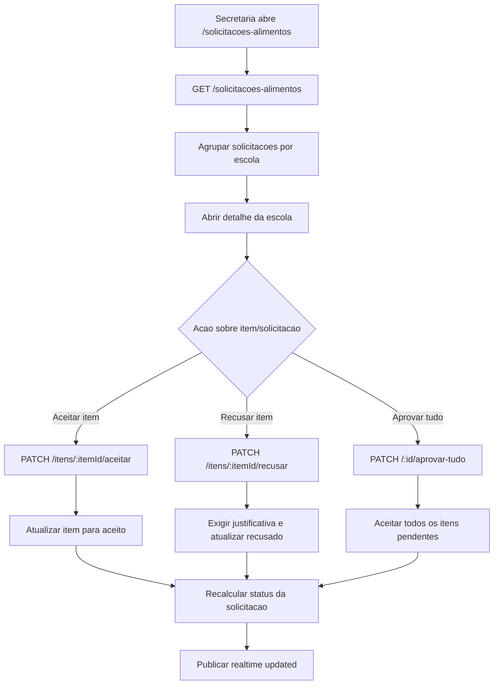

# Fluxo - Resposta da secretaria

```mermaid
flowchart TD
  A["Secretaria abre /solicitacoes-alimentos"] --> B["GET /solicitacoes-alimentos"]
  B --> C["Agrupar solicitacoes por escola"]
  C --> D["Abrir detalhe da escola"]
  D --> E{"Acao sobre item/solicitacao"}
  E -->|Aceitar item| F["PATCH /itens/:itemId/aceitar"]
  E -->|Recusar item| G["PATCH /itens/:itemId/recusar"]
  E -->|Aprovar tudo| H["PATCH /:id/aprovar-tudo"]
  F --> I["Atualizar item para aceito"]
  G --> J["Exigir justificativa e atualizar recusado"]
  H --> K["Aceitar todos os itens pendentes"]
  I --> L["Recalcular status da solicitacao"]
  J --> L
  K --> L
  L --> M["Publicar realtime updated"]
```
