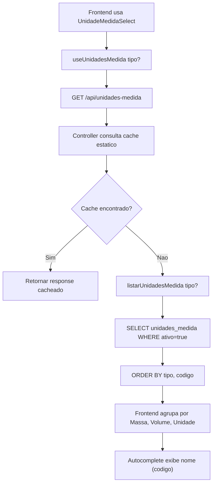

# Fluxo - Catalogo de unidades

```mermaid
flowchart TD
  A["Frontend usa UnidadeMedidaSelect"] --> B["useUnidadesMedida tipo?"]
  B --> C["GET /api/unidades-medida"]
  C --> D["Controller consulta cache estatico"]
  D --> E{"Cache encontrado?"}
  E -->|Sim| F["Retornar response cacheado"]
  E -->|Nao| G["listarUnidadesMedida tipo?"]
  G --> H["SELECT unidades_medida WHERE ativo=true"]
  H --> I["ORDER BY tipo, codigo"]
  I --> J["Frontend agrupa por Massa, Volume, Unidade"]
  J --> K["Autocomplete exibe nome (codigo)"]
```
