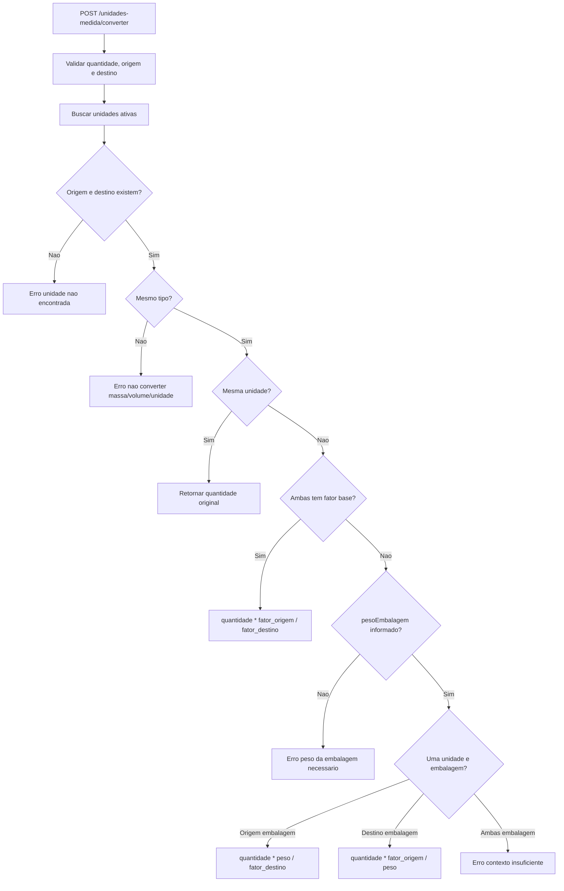

# Fluxo - Conversao de unidades

```mermaid
flowchart TD
  A["POST /unidades-medida/converter"] --> B["Validar quantidade, origem e destino"]
  B --> C["Buscar unidades ativas"]
  C --> D{"Origem e destino existem?"}
  D -->|Nao| E["Erro unidade nao encontrada"]
  D -->|Sim| F{"Mesmo tipo?"}
  F -->|Nao| G["Erro nao converter massa/volume/unidade"]
  F -->|Sim| H{"Mesma unidade?"}
  H -->|Sim| I["Retornar quantidade original"]
  H -->|Nao| J{"Ambas tem fator base?"}
  J -->|Sim| K["quantidade * fator_origem / fator_destino"]
  J -->|Nao| L{"pesoEmbalagem informado?"}
  L -->|Nao| M["Erro peso da embalagem necessario"]
  L -->|Sim| N{"Uma unidade e embalagem?"}
  N -->|Origem embalagem| O["quantidade * peso / fator_destino"]
  N -->|Destino embalagem| P["quantidade * fator_origem / peso"]
  N -->|Ambas embalagem| Q["Erro contexto insuficiente"]
```
