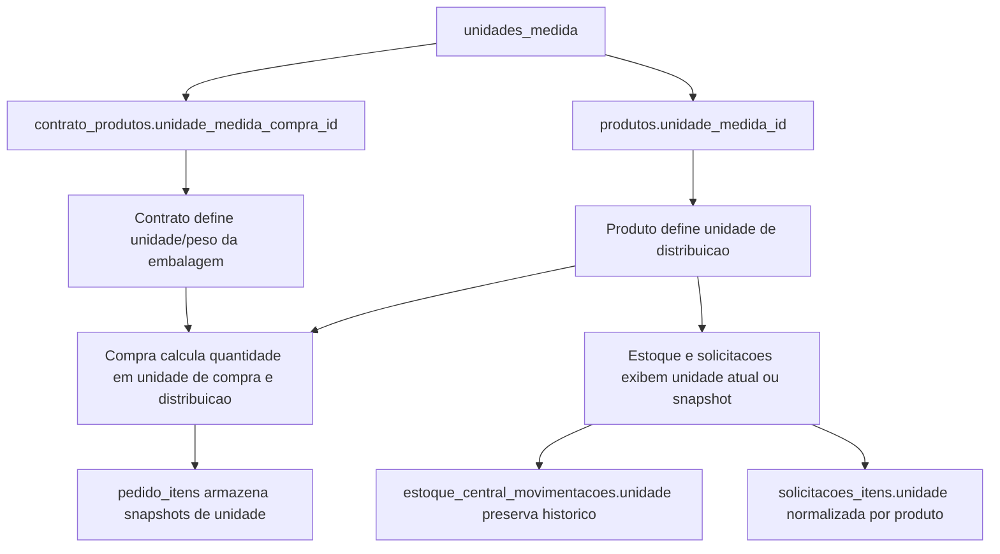

# Fluxo - Uso transversal de unidades

```mermaid
flowchart TD
  A["unidades_medida"] --> B["produtos.unidade_medida_id"]
  A --> C["contrato_produtos.unidade_medida_compra_id"]
  B --> D["Produto define unidade de distribuicao"]
  C --> E["Contrato define unidade/peso da embalagem"]
  D --> F["Compra calcula quantidade em unidade de compra e distribuicao"]
  E --> F
  F --> G["pedido_itens armazena snapshots de unidade"]
  D --> H["Estoque e solicitacoes exibem unidade atual ou snapshot"]
  H --> I["estoque_central_movimentacoes.unidade preserva historico"]
  H --> J["solicitacoes_itens.unidade normalizada por produto"]
```
