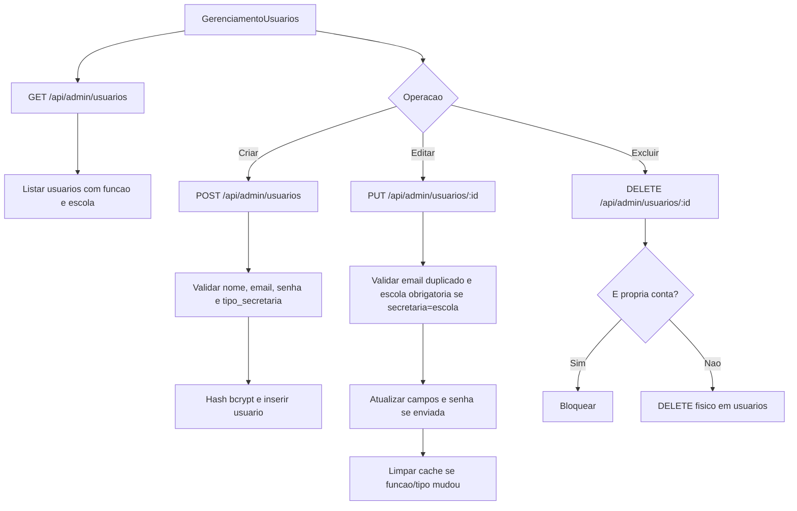

# Fluxo - Administracao de usuarios

```mermaid
flowchart TD
  A["GerenciamentoUsuarios"] --> B["GET /api/admin/usuarios"]
  B --> C["Listar usuarios com funcao e escola"]
  A --> D{"Operacao"}
  D -->|Criar| E["POST /api/admin/usuarios"]
  E --> F["Validar nome, email, senha e tipo_secretaria"]
  F --> G["Hash bcrypt e inserir usuario"]
  D -->|Editar| H["PUT /api/admin/usuarios/:id"]
  H --> I["Validar email duplicado e escola obrigatoria se secretaria=escola"]
  I --> J["Atualizar campos e senha se enviada"]
  J --> K["Limpar cache se funcao/tipo mudou"]
  D -->|Excluir| L["DELETE /api/admin/usuarios/:id"]
  L --> M{"E propria conta?"}
  M -->|Sim| N["Bloquear"]
  M -->|Nao| O["DELETE fisico em usuarios"]
```
