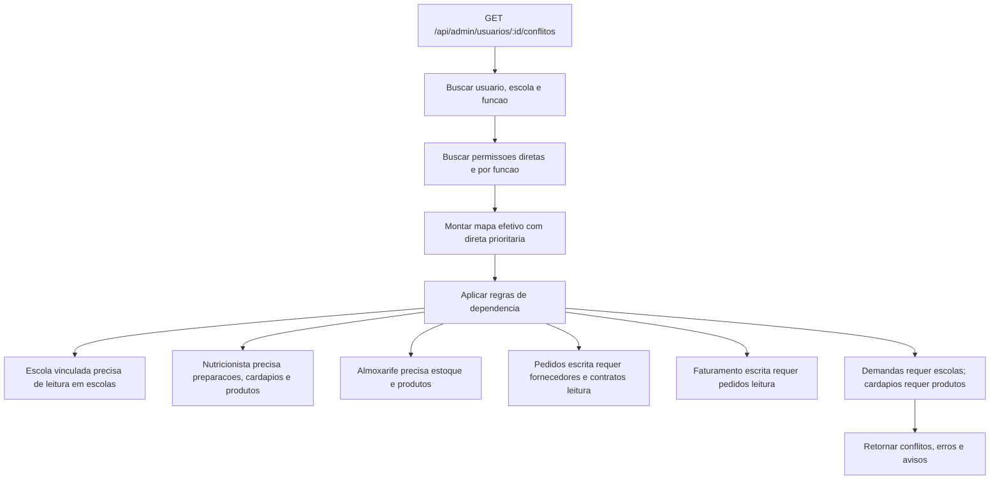

# Fluxo - Verificacao de conflitos de permissao

```mermaid
flowchart TD
  A["GET /api/admin/usuarios/:id/conflitos"] --> B["Buscar usuario, escola e funcao"]
  B --> C["Buscar permissoes diretas e por funcao"]
  C --> D["Montar mapa efetivo com direta prioritaria"]
  D --> E["Aplicar regras de dependencia"]
  E --> F["Escola vinculada precisa de leitura em escolas"]
  E --> G["Nutricionista precisa preparacoes, cardapios e produtos"]
  E --> H["Almoxarife precisa estoque e produtos"]
  E --> I["Pedidos escrita requer fornecedores e contratos leitura"]
  E --> J["Faturamento escrita requer pedidos leitura"]
  E --> K["Demandas requer escolas; cardapios requer produtos"]
  K --> L["Retornar conflitos, erros e avisos"]
```
