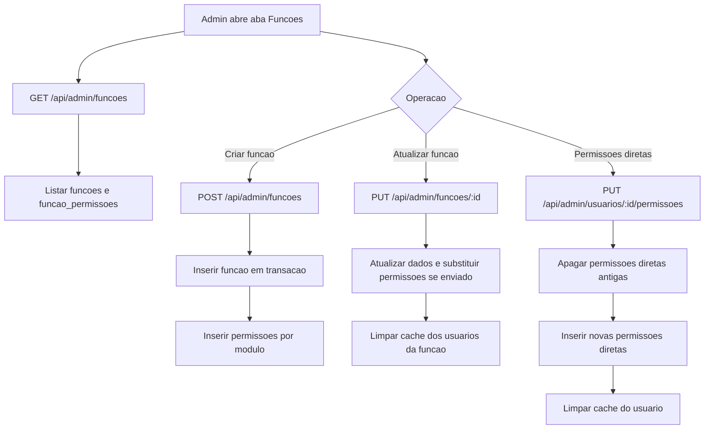

# Fluxo - Funcoes e permissoes

```mermaid
flowchart TD
  A["Admin abre aba Funcoes"] --> B["GET /api/admin/funcoes"]
  B --> C["Listar funcoes e funcao_permissoes"]
  A --> D{"Operacao"}
  D -->|Criar funcao| E["POST /api/admin/funcoes"]
  E --> F["Inserir funcao em transacao"]
  F --> G["Inserir permissoes por modulo"]
  D -->|Atualizar funcao| H["PUT /api/admin/funcoes/:id"]
  H --> I["Atualizar dados e substituir permissoes se enviado"]
  I --> J["Limpar cache dos usuarios da funcao"]
  D -->|Permissoes diretas| K["PUT /api/admin/usuarios/:id/permissoes"]
  K --> L["Apagar permissoes diretas antigas"]
  L --> M["Inserir novas permissoes diretas"]
  M --> N["Limpar cache do usuario"]
```
