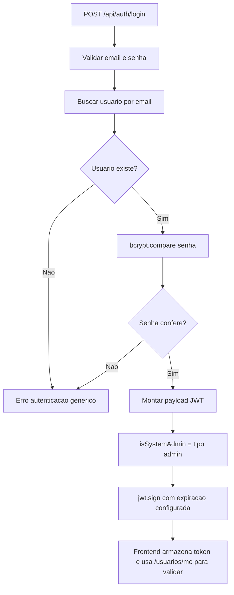

# Fluxo - Login de usuarios

```mermaid
flowchart TD
  A["POST /api/auth/login"] --> B["Validar email e senha"]
  B --> C["Buscar usuario por email"]
  C --> D{"Usuario existe?"}
  D -->|Nao| E["Erro autenticacao generico"]
  D -->|Sim| F["bcrypt.compare senha"]
  F --> G{"Senha confere?"}
  G -->|Nao| E
  G -->|Sim| H["Montar payload JWT"]
  H --> I["isSystemAdmin = tipo admin"]
  I --> J["jwt.sign com expiracao configurada"]
  J --> K["Frontend armazena token e usa /usuarios/me para validar"]
```
