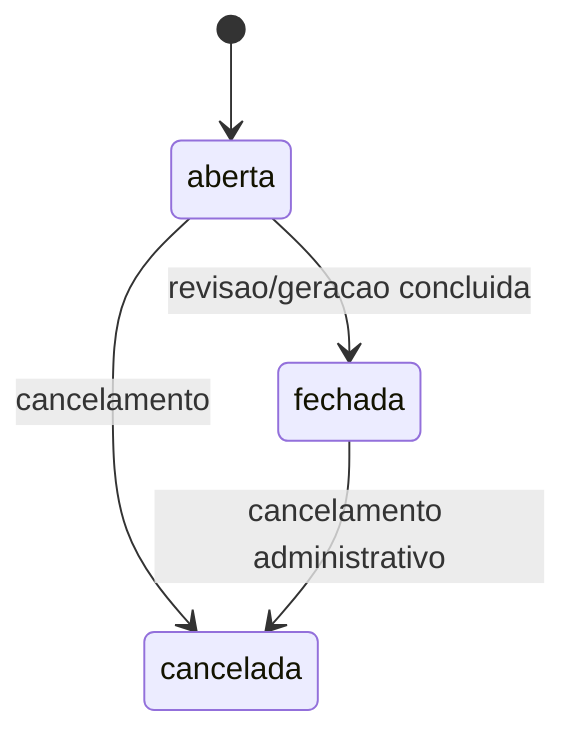
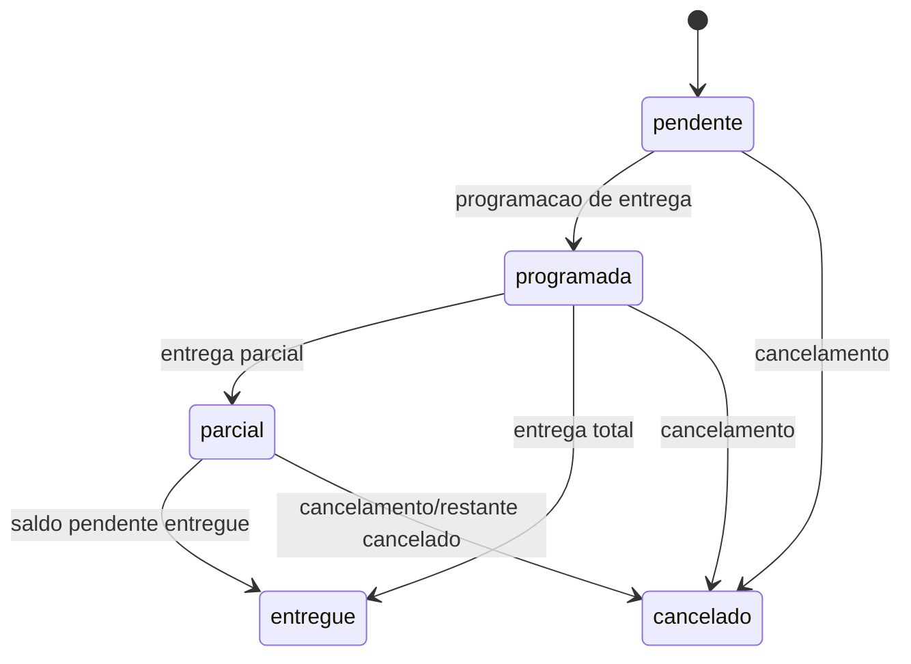
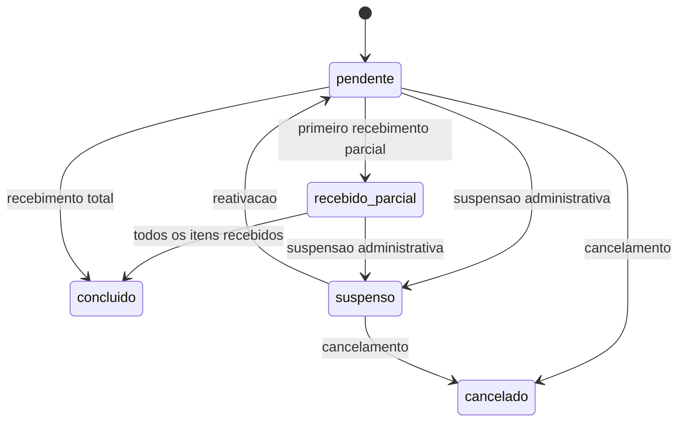
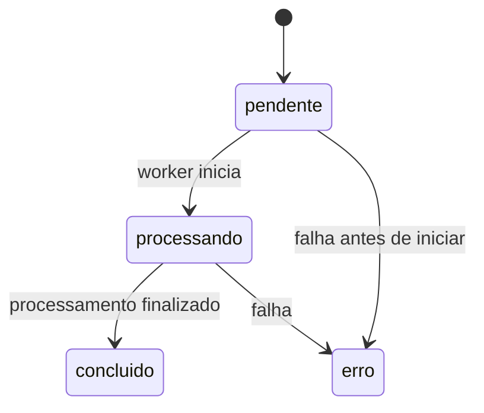
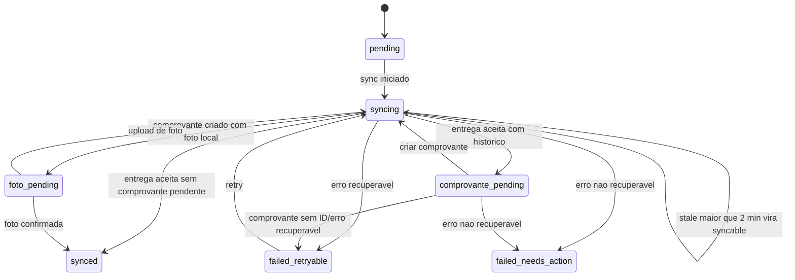
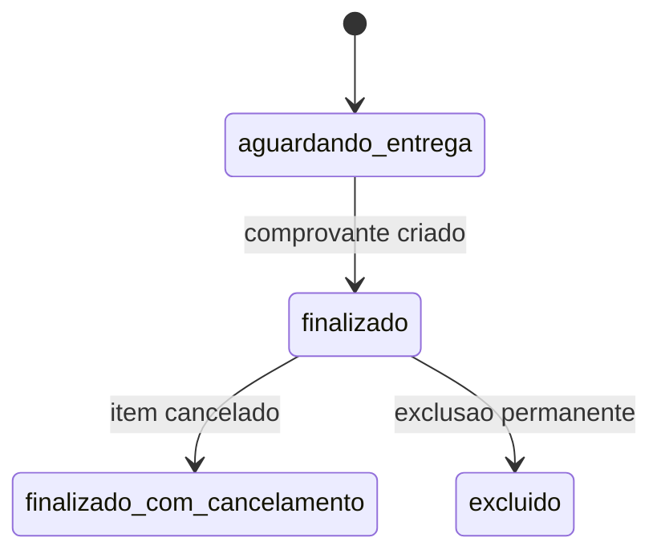
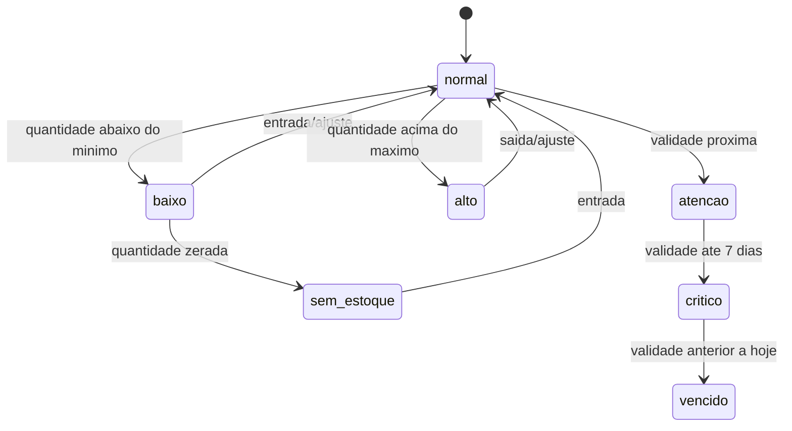
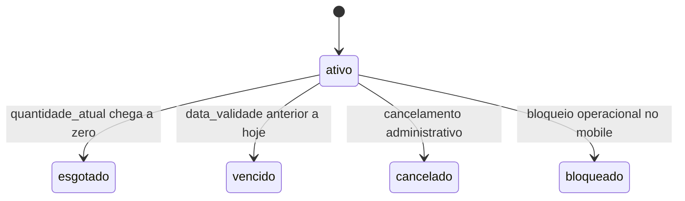
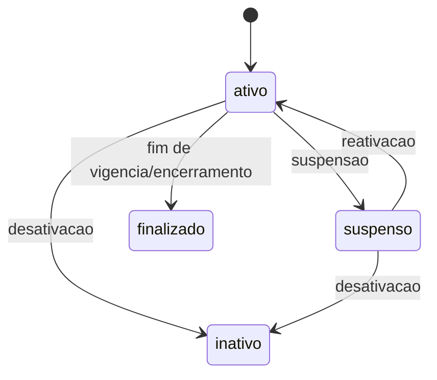
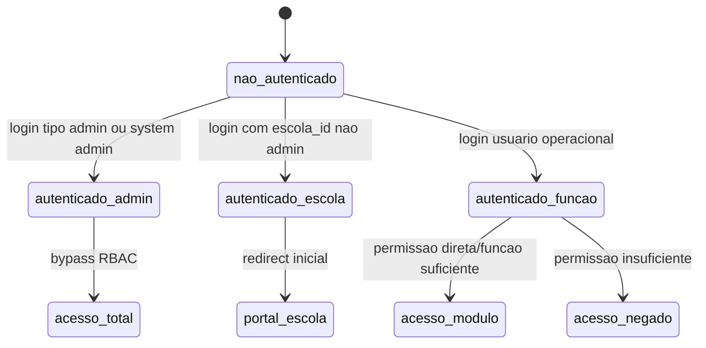

# Maquinas de Estado - gestaoescolar

Gerado pelo Reversa Detective em 2026-04-29.

## Guia de demanda

Valores confirmados: `aberta`, `fechada`, `cancelada`.

Confianca: INFERIDO para transicoes; valores confirmados em `frontend/src/modules/abastecimento/status.ts`.

## Item de guia

Valores confirmados: `pendente`, `programada`, `parcial`, `entregue`, `cancelado`.

Confianca: CONFIRMADO para valores; INFERIDO para algumas transicoes.

## Pedido/Compra

Valores confirmados: `pendente`, `recebido_parcial`, `concluido`, `suspenso`, `cancelado`.

Confianca: CONFIRMADO para valores; INFERIDO para transicoes.

## Job assincrono

Valores confirmados: `pendente`, `processando`, `concluido`, `erro`.

Confianca: CONFIRMADO em tipos de job documentados pelo Archaeologist.

## Entrega offline/outbox

Valores confirmados em `apps/entregador-native/src/services/deliveryOutboxCore.ts`: `pending`, `syncing`, `failed_retryable`, `failed_needs_action`, `comprovante_pending`, `foto_pending`, `synced`.

Regras:

- CONFIRMADO: `failed` legado normaliza para `failed_retryable`.
- CONFIRMADO: `failed_needs_action` pode voltar para `failed_retryable` se erro for saldo recuperavel ou infraestrutura.
- CONFIRMADO: `syncing` com mais de 2 minutos e considerado stale e pode sincronizar de novo.

## Comprovante de entrega

Valores vistos: `finalizado` na UI; cancelamento/exclusao por endpoints.

Confianca: INFERIDO. `finalizado` e confirmado em UI; estados intermediarios sao modelados pelo comportamento de endpoints.

## Estoque escolar/mobile

Valores confirmados: `sem_estoque`, `baixo`, `normal`, `alto`, `vencido`, `critico`, `atencao`.

Confianca: CONFIRMADO para valores e validacoes de quantidade/validade; INFERIDO para combinacao entre estados de saldo e validade.

## Lote de estoque

Valores confirmados em tipos: `ativo`, `esgotado`, `vencido`, `cancelado`; app mobile tambem usa `bloqueado`.

Confianca: CONFIRMADO para valores principais; LACUNA para `bloqueado` versus backend.

## Contrato

Valores confirmados: `ativo`, `inativo`, `suspenso`, `finalizado`.

Confianca: CONFIRMADO para valores; INFERIDO para transicoes.

## Usuario/acesso

Confianca: CONFIRMADO em `authMiddleware`, `useUserRole`, `useUserPermissions`, `PermissionGuard` e `AppRouter`.
