# Fluxo de Navegacao UI - gestaoescolar

```mermaid
flowchart TD
  Login["Login"] --> Dashboard["Dashboard /dashboard"]

  Dashboard --> QuickEscolas["Atalho Escolas"]
  Dashboard --> QuickProdutos["Atalho Produtos"]
  Dashboard --> QuickCardapios["Atalho Cardapios"]
  Dashboard --> QuickEstoque["Atalho Estoque Central"]
  Dashboard --> QuickPedidos["Atalho Pedidos"]
  Dashboard --> Pnae["Detalhes do PNAE"]

  QuickEscolas --> EscolasLista["Escolas /escolas"]
  MenuCadastros["Sidebar Cadastros"] --> EscolasLista
  MenuCadastros --> Modalidades["Modalidades"]
  MenuCadastros --> Produtos["Produtos"]
  MenuCadastros --> Nutricionistas["Nutricionistas"]
  MenuCadastros --> Fornecedores["Fornecedores"]
  MenuCadastros --> Contratos["Contratos"]

  EscolasLista -->|"Visualizar/linha"| EscolaDetalhe["Detalhe Escola /escolas/:id"]
  EscolasLista -->|"Nova Escola"| EscolaForm["Modal/Form Nova Escola"]
  EscolasLista -->|"Editar"| EscolaEdit["Modal/Form Editar Escola"]
  EscolasLista -->|"Excluir"| EscolaDelete["Confirmacao Excluir Escola"]
  EscolaDetalhe -->|"Adicionar modalidade"| ModalidadeEscola["Modal Adicionar Modalidade"]
  EscolaDetalhe -->|"Editar modalidade"| ModalidadeEdit["Modal Editar Alunos"]
  EscolaDetalhe -->|"Excluir modalidade"| ModalidadeDelete["Confirmacao Excluir Modalidade"]

  MenuCardapios["Sidebar Cardapios"] --> CardapiosLista["Cardapios /cardapios"]
  MenuCardapios --> Preparacoes["Preparacoes"]
  MenuCardapios --> TiposRefeicao["Tipos de Refeicao"]
  CardapiosLista -->|"Novo Cardapio"| CardapioForm["Modal/Form Cardapio"]
  CardapiosLista -->|"Visualizar"| CardapioCalendario["Calendario /cardapios/:id/calendario"]
  CardapiosLista -->|"Editar"| CardapioEdit["Modal/Form Editar Cardapio"]
  CardapiosLista -->|"Excluir"| CardapioDelete["Confirmacao Excluir Cardapio"]
  CardapioCalendario -->|"Toggle mensal"| CalendarioMensal["Visao mensal"]
  CardapioCalendario -->|"Toggle semanal"| CalendarioSemanal["Visao semanal"]
  CardapioCalendario -->|"Imprimir"| CardapioPdf["PDF Cardapio"]
  CardapioCalendario -->|"Detalhes custo"| CustoDetalhe["Modal Custo Cardapio"]

  MenuAbastecimento["Sidebar Abastecimento"] --> VisaoGeral["Visao Geral"]
  MenuAbastecimento --> GuiasDemanda["Guias de Demanda"]
  MenuAbastecimento --> ComprasPedidos["Compras / Pedidos"]
  MenuAbastecimento --> Entregas["Entregas /entregas"]
  Entregas -->|"Romaneio"| Romaneio["Romaneio /entregas/romaneio"]
  Entregas -->|"Visualizar escola"| EntregaEscola["Detalhe de Entrega por Escola"]
  Entregas -->|"PDF"| EntregaPdf["PDF de Entrega/Romaneio"]
  Entregas -->|"Selecionar multiplas"| EntregaBulk["Selecao multipla"]

  MenuEstoque["Sidebar Estoque"] --> EstoqueCentral["Estoque Central /estoque-central"]
  EstoqueCentral -->|"Atualizar"| EstoqueRefresh["Recarregar saldos"]
  EstoqueCentral -->|"Entrada"| EntradaEstoque["Modal Entrada"]
  EstoqueCentral -->|"Saida"| SaidaEstoque["Modal Saida"]
  EstoqueCentral -->|"Ajuste"| AjusteEstoque["Modal Ajuste"]
  EstoqueCentral -->|"Transferir"| TransferenciaEstoque["Modal Transferencia"]
```

## Fluxos principais observados

1. Dashboard para cadastros: dashboard ou sidebar abre lista de escolas; lista abre detalhe; detalhe permite gerenciar modalidades.
2. Cardapios: lista de cardapios abre calendario; calendario alterna visao mensal/semanal e exibe resumo/custo.
3. Abastecimento: sidebar abre entregas; entregas mostra progresso por escola, permite romaneio, PDF e visualizacao.
4. Estoque: sidebar abre estoque central; tela permite filtrar produto e acionar entrada/saida/ajuste/transferencia quando um item esta selecionado.
